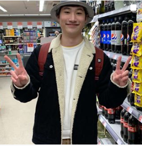

# Requirements Engineering

## Überblick

SwissMemeSupply soll eine Webseite werden, auf der Memes hochgeladen, kategorisiert und angeschaut werden können.

## Personas

### Simon

- 13 Jahre alt
- Klassenclown
- Hat schon eine "Freundin"
- Verbringt seine Freizeit mit Freunden oder surft alleine im Internet
- Findet das Anschauen von Dankmemes lustig

### Miriam

- 61 Jahre alt
- Verheiratet
- Wohnhaft in einem Einfamilienhaus in Ballwil
- Hausfrau
- 3 Kinder (der Älteste geht auf eine Behindertenschule)
- Arbeitet gerne im Garten
- Hat von ihren Kindern von "Memes" gehört und möchte wissen, was das ist

### Michelle

- 21 Jahre alt
- Männlich
- Lebt noch bei seinen Eltern und arbeitet auch von da aus
- Hat wenige Freunde und fast keine sozialen Kontakte
- Verbringt Grossteil seiner Freizeit auf reddit und 4chan
- Hat 700k Post-Karma auf reddit
- Liebt es, selber Memes zu erstellen und diese über das Internet zu verbreiten

## User Stories

1) Da Simon sich nur für Dankmemes interessiert, will er auch nur diese anschauen. Er möchte, dass er nach dieser Art von Memes filtern kann.
2) Simon möchte die Memes auf der Webseite anschauen können, ohne sich registrieren oder einloggen zu müssen, da ihm das zu lange dauert und er auf eine andere Seite wechseln würde.
3) Miriam möchte in einem kurzen Text erfahren, was Memes überhaupt sind, da sie keine Ahnung davon hat und von ihren Kindern ausgelacht wird.
4) Miriam will mit ihrem Smartphone bequem die Webseite benutzen können, da sie sonst kein anderer Computer oder Laptop hat. Sie will auch, dass die Seite möglichst schnell lädt, da sie noch viel im Haushalt zu tun hat.
5) Michelle möchte, dass es möglichst jede Meme-Kategorie zur Auswahl gibt. Falls es eine nicht gibt, möchte er selber eine erstellen.
6) Michelle will einen Account mit einem von ihm definierten Avatar und Benutzernamen, damit er Memes hochladen kann und jeder User seinen lustigen Avatar und Benutzernamen sieht.
7) Michelle will, dass er Memes teilen kann. Damit will er anderen Leuten zeigen, was für lustige Memes er erstellt.

## Verwendete Elemente

- Selbst erstelltes Logo (Vektorgrafik)
- Eine selbst erstellte Videosequenz (Direkt eingebunden)
- Bild aus dem Web (Urheberrecht berücksichtigen)
- Mehrere selbst erstellte Bilder (Pixelgrafik)
